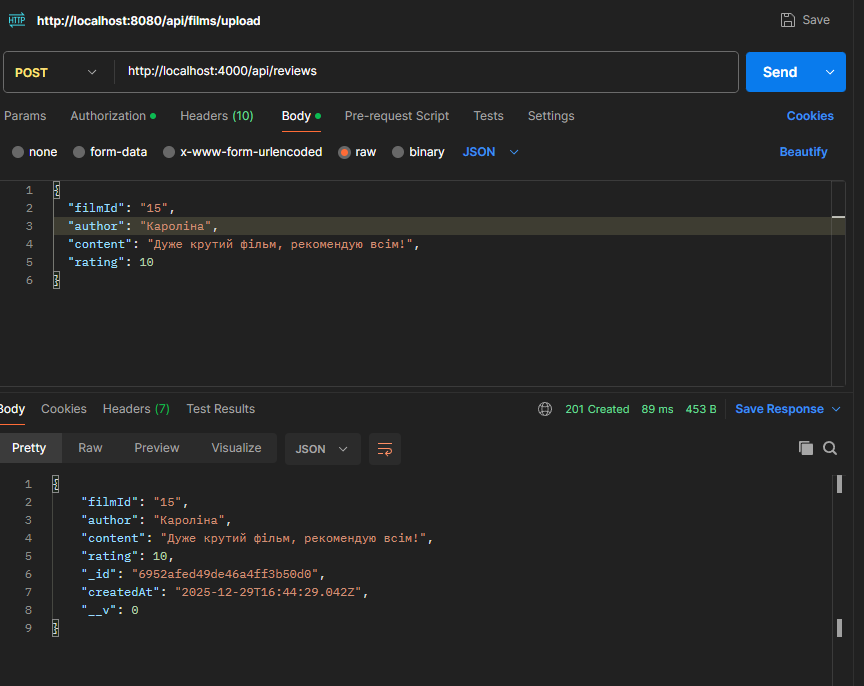

# 🎬 Review Service

Даний сервіс є частиною системи **FilmService (Блок 4)** і відповідає за управління 
рецензіями на фільми. Він реалізований як мікросервіс, що взаємодіє з основним 
Java-сервісом для валідації даних.

## Основні можливості

- Створення рецензій з обов'язковою перевіркою існування фільму в зовнішньому API.
- Отримання списку рецензій з підтримкою пагінації (`size`, `from`) та сортуванням від новіших до старіших.
- Агрегаційний підрахунок кількості рецензій для масиву фільмів одним запитом.
- Покриття інтеграційними тестами всіх ендпоінтів.

---

- **Backend:** Node.js, Express, TypeScript
- **Database:** MongoDB, Mongoose (ODM)
- **Communication:** Axios (для запитів до Spring Boot сервісу)
- **Testing:** Jest, Supertest

---

## API Endpoints

### 1. Створення рецензії
POST /api/reviews

**Body:**
{
  "filmId": "string",
  "author": "string",
  "content": "string",
  "rating": number
}

Особливість: Автоматично проставляє дату створення. Перед збереженням робить запит до http://localhost:8080/api/films/{id}.

--- 

### 2. Отримання списку рецензій
GET /api/reviews?filmId={id}&size=5&from=0

Параметри:

- filmId 

- size 

- from 

- Сортування: по полю createdAt

---

### 3. Масовий підрахунок
POST /api/reviews/_counts

Body:

{
  "entity1Ids": ["id1", "id2", ...]
}

Особливість: Використовує MongoDB Aggregation Framework для високої продуктивності.

---
### Тестування

Для перевірки працездатності сервісу без запуску всього оточення використовуються моки (mocks)
для Axios.

Запуск тестів:

npm test

🛠 Інструкція із запуску

Клонувати репозиторій:

git clone https://github.com/karolinabalukh/FilmServiceUI.git
cd reviews-service

Встановити залежності:

npm install

Налаштувати БД:
Переконайтеся, що MongoDB запущена за адресою:

mongodb://127.0.0.1:27017/reviews-service

Запустити сервіс:

npm run dev

Сервіс буде доступний за адресою: http://localhost:4000.
